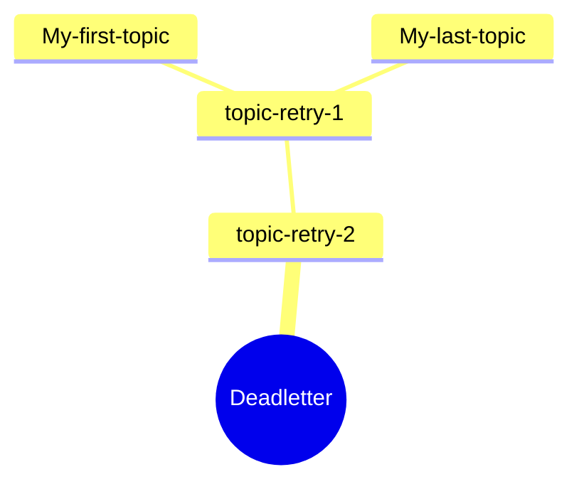
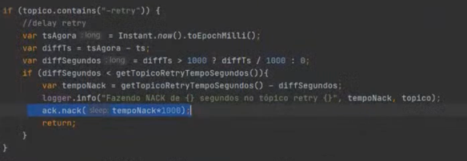

# Messaging - Failure Handling

This document summarizes personal key takeaways from https://www.youtube.com/watch?v=t8_y5Ac_flo&ab_channel=DXLab
and personal experience and opinions regarding the topic.

## Definitions

Consumer resiliency: The ability of a consumer to handle failures gracefully, without human intervention.

Deadletter topic: A topic where messages that could not be processed are sent to. It is not a queue, it is just another
topic.

## Techniques

Bellow we describe 3 techniques to handle failures in a consumer, simple and selective retry and deadletter.

### Simple retry

Can tackle must cases, simply try again.

It is **useful** for transient errors, like a network error aka timeout.

It should be implement with **caution**, as it can lead to infinite loops and service exhaustion.
Exponential backoff is a good strategy to avoid this.

#### Use if

1. Problem can be resolved by retrying ( ex: business rule failure is not a candidate for retry )
2. No point in going to the next message, since the problem will still persist

### Dead-letter

For latter manual processing. Just another(and one) topic. Alerts are a must have!
**Useful** when retries couldn't resolve or were not applicable, like a business rule failure.
We should be **cautious** when sending messages to the deadletter, making sure that enough information is sent along
with
the
message, like the original topic, partition and exception message.

#### Use if

1. Max number of retries was reached without successfully processing the message
2. Message is not consumable anymore, like a business rule failure

#### Header ideas

Headers can be used to make the deadletter message more rich. Some ideas are:
- deadletter-original-trace-id
- deadletter-original-topic
- deadletter-original-partition
- deadletter-original-offset
- deadletter-original-timestamp
- deadletter-exception-classname
- deadletter-exception-stacktrace
- deadletter-exception-message

### Selective retry

For automated processing, when maybe trying again on a short period is not a good idea.
It might be **useful** for a mix of business rules and transient errors, like - in fintech - if balance is not available
yet for a transfer, might it might be available in X time.
This allows for the unblock processing of the main topic, since messages are sent to a specific topic.
We should be **cautions** in tracking the number of retries - one per topic , so consumers for partitions are not stuck.

#### Retry tracking

One idea is to have a <topic>-retry-1, <topic>-retry-n for the number of possible retries over time.
It is a choreography pattern or chain of responsibility.
Differently from deadletter, which will have manual processing, the selective-retry is per topic, allowing
for automated processing.

#### Implementation

## Good to know

1. Deadletter is not a queue, it is just another topic
2. Although this project uses headers to store original topic, partitions and such; this is not a kafka standard. This
   ust be implemented by the producer.
3. nack() is spring boot specific, it is not a kafka standard. From spring
   docs: `discard remaining records from the poll and re-seek all partitions so that this record will be redelivered after the sleep duration.`
4. KISS is a main principle of this! Otherwise reply is more complex than the problem itself. Software is complexity
   over a cost.

